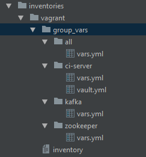

= Ansible workshop 

== *Targeted infrastructure*
OS : Centos 7 +
 
*ci.app.dev :* Jenkins, UCD server, Splunk Forwarder, UCD Agent +
*node0.app.dev :* Zookeeper, Splunk server, Splunk Forwarder, UCD Relay, UCD Agent  +
*node1.app.dev :* Kafka, Splunk Forwarder, UCD Agent +
*node2.app.dev :* Kafka, Splunk Forwarder, UCD Agent +
 
== *The project structure*
A good directory structure will allow us to quickly retrieve information and to easily know where to make new changes. +
The project structure is inspired from the http://docs.ansible.com/ansible/playbooks_best_practices.html#directory-layout[directory layout] proposed by Ansible. +
 
*Inventories*
The first change we make is to move *group_vars* into the inventory directory along with *host_vars* as a workaround of
https://github.com/ansible/ansible/issues/16956[this regression] +
The second change is the playbooks folder in the root folder of the project.
 
.Inventories folder

{nbsp} + 
*Roles folder* +
On the root of the project we have roles folder for *internal roles*. +
For the *external roles* (from Ansible Galaxy) the default folder is /etc/ansible/roles. This requires to give ansible root access.
To avoid the need of using root we put external roles in the home path of the current user.
[source, shell]
.ansible.cfg
----
[defaults]
roles_path = roles:~/.ansible/roles
----

=== *Usage of containers and Roles*
It's very challenging to keep code maintainable when using Configuration Management tools. We try to achieve this
by focusing on minimizing the amount of code (*_less codes == less bugs_*). +

All the components we use in the infrastructure (*Splunk*, *Kafka*, *Zookeeper*) run inside containers. +
Container technologies such as Docker are powerful means of reducing the amount of code needed to manage services lifecycle (start, stop, resume, kill, ...). +
Exception is made for *Jenkins*, the only component that runs directly on the VM, since it can be used to run container.
The Docker team strongly advises against running a https://jpetazzo.github.io/2015/09/03/do-not-use-docker-in-docker-for-ci/[container in a container]. +

On the other hand most of the roles we use may already exist on https://galaxy.ansible.com[Ansible Galaxy]. +
{nbsp} +
The key point here is to : +
 - Prefer container in favor of "_non container_" +
 - Try to use existing roles (from *Ansible Galaxy*) instead of writing new ones. +

== Ansible vault 

We have some sensitive data, such as _vault_ldap_manager_password_ password in _playbooks/templates/ci/config.xml.j2_
 
.config.xml.j2
[source,xml]
----
...
    <managerDN>{{ ldap_manager_dn }}</managerDN>
    <managerPasswordSecret>{{ vault_ldap_manager_password }}</managerPasswordSecret>
...
----
The variable vault_ldap_manager_password is set in inventories/vagrant/group_vars/ci-server/vault.yml and we don't want it to be shared on github in plain text.
 
.vault.yml
[source,shell]
----
vault_ldap_manager_password: toor
----
Ansible provide a feature, *ansible-vault*,  to encrypt/decrypt sensitive data.
…
 
*1.* Set, in a file (Ex ~/.vault_pass.txt), the password to use to encrypt/decrypt the sensitive data.
 
.~/.vault_pass.txt
[source,shell]
----
vault_password
----
 
*2.* Encrypt the password by running the following the command.
…
 
[source,shell]
----
ansible-vault encrypt inventories/vagrant/group_vars/ci-server/vault.yml --vault-password-file ~/.vault_pass.txt
----
The encrypted version of the vault file that will be shared on github.
…
 
.vault.yml
[source,shell]
----
$ANSIBLE_VAULT;1.1;AES256
65613936386634343663623462346539656165346437336330316161313761316365373133336463
6361643237666666636635333830653365663932383536300a323039613438376233386130643630
33363139663235303836373135313533646135636232373163306337633863393131633863636635
3961363937303932650a613263383235656463376663383962616161366336653839323431623661
34376337626631343132363563363131343539313239636163323433326136313434333561663861
6438356263346230333137373031313363363131356362646537
----
See http://docs.ansible.com/ansible/latest/playbooks_best_practices.html#best-practices-for-variables-and-vaults[best practices for variables and vaults]

== *The Vagrantfile*
We want to be able to build locally, with Vagrant, something strongly close to DEV, TEST and Production environments. For that, it's necessary to treat each VM like a real host. +
In his article http://hakunin.com/six-ansible-practices[6 practices for super smooth Ansible experience] Maxim Chernyak shares some inspiring insights : +
- Make it easy to sync your hosts file with your VMs +
- Automate adding your pub key to VMs +
- Configure your ssh client +
 
After installing Vagrant, add *_vagrant-hostsupdater_* plugin to automatically add and remove hosts every time you add or destroy VMs.   +
 
[source,shell]
----
$ vagrant plugin install vagrant-hostsupdater
----

Add *vagrant-vbguest* plugin which will check and update the VirtualBox guest when VirtualBox is upgraded
[source,shell]
----
$ vagrant plugin install vagrant-vbguest
----

The next step is to set up the VMS.
[source,shell]
----
$ vagrant up
----
